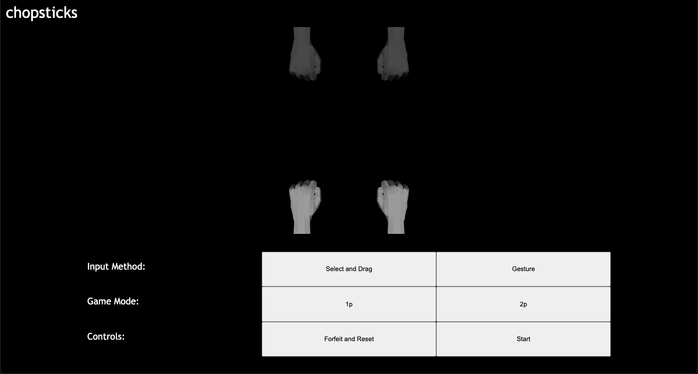

# chopsticks

the game of chopsticks reimagined

## early look

## features (more like a todo)

- single player (vs bot)
- multiplayer (2 players)
  - local (i.e. on the same computer)
  - online
- control in-game hand via irl gestures

## credits

1. [Hand (low poly)](https://skfb.ly/Dr9p "sketchfab.com") by scribbletoad is licensed under [Creative Commons Attribution](http://creativecommons.org/licenses/by/4.0/ "license").
2. [Rigged Lowpoly Hand](https://skfb.ly/6RoCG "sketchfab.com") by JanoschR is licensed under [Creative Commons Attribution](http://creativecommons.org/licenses/by/4.0/ "license").
3. hand poses and animations by me